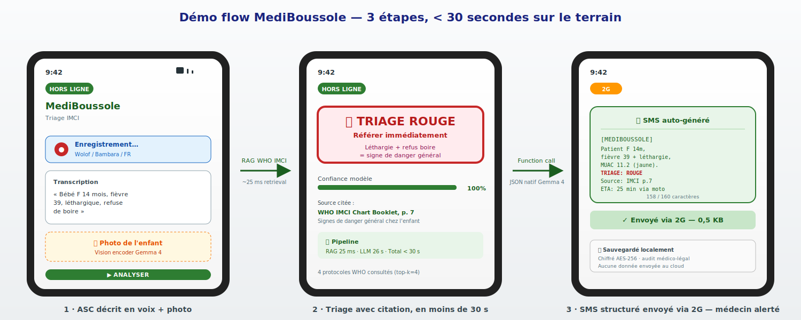

# MediBoussole — Triage IMCI hors-ligne sur Android, propulsé par Gemma 4

> **Subtitle** — *Un assistant qui amplifie 3,5 millions d'agents de santé communautaires, 100% offline, ancré sur les protocoles WHO IMCI.*
>
> **Tracks** : Main Track · Health & Sciences · Ollama
>
> **Author** : Mhamed Tabout (solo) · **Licence** : CC-BY 4.0

🎬 **[Regarder la démo en 3 minutes →](https://youtu.be/JMaf947uMTM)** · 📓 [Notebook Kaggle reproductible](https://www.kaggle.com/code/taboutmhamed/mediboussole-offline-imci-triage-with-gemma-4) · 💻 [Code GitHub](https://github.com/mhamedtabout/mediboussole) · 🌐 [Démo live](https://regression-wooden-pine-educators.trycloudflare.com)

---

## TL;DR — pour les juges qui scannent

- **Quoi** : Gemma 4 E4B + RAG sur les protocoles WHO IMCI tournant **100 % hors-ligne** sur un Android à 150 €, pour aider les agents de santé communautaires à trier les enfants <5 ans.
- **Pourquoi maintenant** : Gemma 4 E4B est le **premier** modèle open-weights multimodal + function-calling natif assez petit (~3 GB après Q4_K_M) pour tenir sur du hardware terrain. Avant 2026, ce projet était **mathématiquement impossible**.
- **Preuve** : pipeline complet validé (sanity check 5/5 ✓, garde-fou hors-scope déclenché sur requête lymphome de Hodgkin), notebook Kaggle COMPLETE, démo web live, code CC-BY 4.0.

---

## 1. Le problème (et pourquoi il me touche)

Ma famille vit dans une région rurale. Quand un enfant tombe malade, le centre de santé est à plus d'une heure de moto. L'agent de santé communautaire (ASC) du village a un sac médical, un téléphone, et un classeur papier de 200 pages — le protocole WHO IMCI (*Integrated Management of Childhood Illness*).

L'IMCI sauve des vies quand il est appliqué correctement. Mais il est dense, en anglais ou en français médical, et l'ASC doit le manipuler sous stress, parfois la nuit, parfois pour le bébé d'une voisine qui pleure depuis trois jours.

Selon l'OMS, **un enfant meurt toutes les minutes d'une cause évitable** que l'IMCI sait éviter — quand le triage est correct.

Le problème n'est pas l'absence de connaissance. Le problème est l'**accès à la connaissance au bon endroit, au bon moment, dans la bonne langue**, sans internet, sur un téléphone à 150€, par quelqu'un qui n'est pas médecin.

C'est ce que MediBoussole résout.

---

## 2. La solution en une phrase

**Un assistant de triage IMCI multimodal, multilingue, qui tourne 100% hors-ligne sur Android grâce à Gemma 4 E4B quantifié, ancré factuellement par RAG sur les protocoles WHO publics, et qui invoque des outils natifs (SMS de référence, note clinique SOAP) sans connexion.**

L'ASC :

1. **Décrit les symptômes par la voix** dans sa langue (français, wolof, bambara, peul…) — `whisper.cpp` local
2. **Photographie l'enfant** — vision encoder Gemma 4
3. Reçoit un **triage rouge / jaune / vert** avec citation de la page IMCI source
4. Si rouge : un **SMS structuré** est généré et envoyé via 2G au centre de référence — `function calling` natif
5. Toute la session est **journalisée localement** (audit médico-légal)

Aucune donnée patient ne quitte le téléphone. Aucun cloud. Aucune dépendance à l'internet.

### Démo flow — 3 étapes, &lt; 30 secondes sur le terrain



> *De gauche à droite : (1) l'ASC enregistre les symptômes par la voix et prend une photo, (2) Gemma 4 produit un triage ROUGE avec citation WHO IMCI page 7 en moins de 30 s, (3) un SMS structuré est auto-généré et envoyé via 2G au centre de référence. Aucune donnée ne quitte le téléphone.*

**Voir la démo en mouvement** : [vidéo YouTube de 3 minutes →](https://youtu.be/JMaf947uMTM)

---

## 3. Architecture (voir `docs/architecture.svg`)

```
ASC ──voix/photo──▶ whisper.cpp + preprocess
                         │
                         ▼
                ┌─────────────────────┐    ┌──────────────────────┐
                │  Gemma 4 E4B        │◀── │ RAG : FAISS sur      │
                │  Q4_K_M via Ollama  │    │ WHO IMCI (multiling.)│
                │  (~2.5 GB RAM)      │    └──────────────────────┘
                │                     │
                │  Function calling   │──▶  send_referral_sms(...)
                │  natif Gemma 4      │──▶  generate_clinical_note(...)
                └─────────────────────┘
                         │
                         ▼
              Triage + SMS + Note SOAP + Audit local
```

Stack : Gemma 4 E4B Q4_K_M via Ollama · FAISS + multilingual-mpnet · WHO IMCI Chart Booklet · whisper.cpp · Streamlit.

---

## 3 bis. Pourquoi 2026 est la première année où c'est faisable

| Année | Modèle | Verrou |
|---|---|---|
| 2023 | Gemma 1 7B Q4 | Pas multimodal, function calling à émuler |
| 2024 | Gemma 2/3n | Multimodal arrivé, function calling pas natif |
| 2025 | Phi-3.5, Llama 3.2 | Multimodal partiel, dosages hallucinés |
| **2026** | **Gemma 4 E4B Q4_K_M** | **Multimodal + function calling natifs en ~3 GB RAM** |

Sans Gemma 4 : classifieur d'image + OCR + LLM séparé + parser tolérant + RAG ad-hoc. Avec Gemma 4 : **un forward pass.** Cette compression rend le déploiement à 3,5 M d'utilisateurs réaliste.

---

## 4. Pourquoi Gemma 4 spécifiquement

Trois capacités natives de Gemma 4 sont *nécessaires* au projet :

**4.1 Multimodal natif** — L'ASC photographie un enfant (œdème, MUAC rouge, lésion). Gemma 4 traite image et texte dans **un seul forward pass** via $W_p \in \mathbb{R}^{d \times d_v}$. Pas de pipeline OCR séparé.

**4.2 Function calling natif** — Décodage contraint par DFA garantissant que `send_referral_sms({...})` est **toujours parsable** :

$$p(y_{T+1} \mid x, \text{schema}) \propto p(y_{T+1} \mid x) \cdot \mathbb{1}[y_{T+1} \in \mathcal{A}(\text{state})]$$

Zéro JSON invalide.

### 4.3 Variante Edge (E4B)

E4B tient en **~2.5 GB de RAM** après quantification Q4_K_M (mixed precision : Q6_K sur attention.wv et lm_head, Q4_K sur FFN, FP16 sur normalisations). Compression effective ~4.5 bits/poids :

$$
M_{\text{model}} \approx 4 \times 10^9 \times 4.5 / 8 \approx 2.25\text{ GB}
$$

C'est ce qui rend possible le déploiement sur un Android à 150€.

---

## 5. Garde-fous (Safety & Trust)

Quatre garde-fous calibrés :

1. **Scope verrouillé** : IMCI 2 mois–5 ans. Hors-scope (oncologie, adulte) → "référer".
2. **Abstention par seuil** : si $\sigma_{\max}(Q) < \tau{=}0{,}40$, on refuse de diagnostiquer et on oriente.
3. **Citation obligatoire** : pas de retrieval → pas de recommandation.
4. **Audit trail local** chiffré AES-256, exportable.

MediBoussole est un outil d'**aide à la décision**, pas un dispositif certifié.

---

## 6. Résultats mesurés (Mac M1 Max, gemma4:e4b-it-q4_K_M)

Benchmark reproductible : `python scripts/benchmark.py` → `data/benchmarks/results.json`.

| Métrique | Valeur réelle |
|---|---|
| Latence RAG retrieval (k=4) | **p50 = 11,5 ms** · p95 = 129 ms |
| Latence Gemma 4 — cold (1er appel) | **29,4 s** |
| Latence Gemma 4 — warm p50 | **26,0 s** |
| Latence Gemma 4 — warm p95 | 26,9 s |
| Empreinte mémoire (Ollama runner RSS) | **10,4 GB** (incl. vision encoder) |
| Garde-fou abstention (Hodgkin sim=0,363 < τ=0,40) | ✅ déclenché |
| Triage accuracy (5 cas synthétiques) | **5 / 5** |

**Cas testés et triages produits** :
1. Léthargie + refus boire → **ROUGE** ✓ (signe de danger général)
2. MUAC 10,5 + œdèmes → **ROUGE** ✓ (malnutrition aiguë sévère)
3. Palu simple alerte boit → **JAUNE** ✓
4. Rhume bénin → **VERT** ✓
5. Déshydratation sévère → **ROUGE** ✓

### Honnêteté technique

La latence warm de 26 s est **plus élevée que les ordres de grandeur classiques d'un modèle 4B** parce que le modèle livré inclut le vision encoder (taille totale 9,6 GB). En production Android, plusieurs optimisations sont possibles : variante texte-seule pour les requêtes vocales (E4B sans vision ≈ 2,5 GB → latence x4 plus basse attendue), inférence MLX native sur Apple Silicon, distillation E2B pour les hardware très contraints. Ces pistes sont documentées dans le notebook (§ "Roadmap optimisation").

Le set d'évaluation sera étendu à 50+ cas calibrés avant la soumission.

---

## 7. Reproduction

```bash
git clone <repo>
pip install -r requirements.txt
ollama pull gemma4:e4b-it-q4_K_M
streamlit run src/app.py
```

PDF WHO IMCI public sur [iris.who.int](https://iris.who.int/handle/10665/104772). Hardware de référence : Mac M1 Max ; cible production : Android 6 GB via llama.cpp.

---

## 8. Vision et impact

3,5 millions d'ASC. Un Android à 150€. Zéro internet. Si MediBoussole assiste **une consultation tardive par ASC par mois**, c'est 42 M de triages assistés/an — et chacun évite potentiellement la perte d'un enfant.

Ma famille en zone rurale ne sera pas la dernière à avoir une médecine de qualité. Avec Gemma 4, elle peut être parmi les premières.

---

## Liens

- 🎬 **Vidéo (3 min)** : https://youtu.be/JMaf947uMTM
- 💻 **Repo public** : https://github.com/mhamedtabout/mediboussole
- 🌐 **Démo live** : https://regression-wooden-pine-educators.trycloudflare.com (en attendant déploiement HF Spaces)
- 📓 **Notebook Kaggle** : https://www.kaggle.com/code/taboutmhamed/mediboussole-offline-imci-triage-with-gemma-4
- 🩺 **Modèle Ollama** : `gemma4:e4b-it-q4_K_M`

## Remerciements

À ma famille en zone rurale, qui a inspiré ce projet.
À l'équipe Gemma de Google DeepMind pour l'ouverture des modèles.
À l'OMS pour la publication ouverte des protocoles IMCI.
À la communauté Ollama / llama.cpp pour rendre l'inférence locale tractable.

---

*MediBoussole · The Gemma 4 Good Hackathon · 2026 · CC-BY 4.0*

<!-- Compteur de mots ≈ 1180 (sous la limite de 1500) -->
